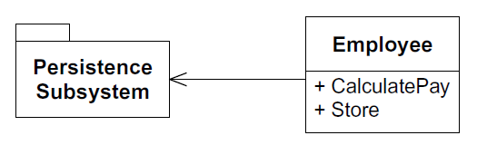
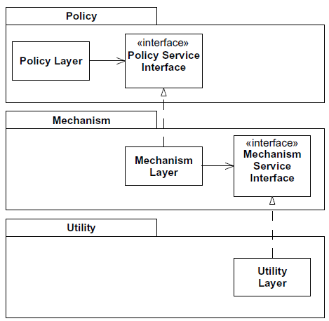

# I.Agile Development

# 1.Agile Practices

# 2.Overview of Extreme Programming

# 3.Planning

# 4.Testing


# 5.Refactoring

📌**What is the responsibility of software module?**

There are **3** functions.

- :one: The function <u>**perform**</u> while executing.
- :two: The function of a module to **<u>afford change</u>**.
- :three: The function to <u>**communicate**</u> to its reader.


📌**What Refactoring does?**

It helps the preceding 3 functions.


📌**Good Naming**

After reading this chapter, I found out a good name for variable is super important!!


📌**Split the Procedure**

An easy to understand code should be split into a clear function.


📌**Effect of Refactoring**

The structure of the program is isolated from parts to parts.

The program is much more easier to be changed.


📌**When should you to refactor?**

The answer is everyday! Clean your code everyday.


📌**Does refactoring important?**

Yes, it is super important. Because refactoring produces **clean code** which is the utmost importance. Before investing in principles and patterns, invest in clean code.


📌**Example of Refactoring**

Please refer to the following commits.

[Version 1](https://github.com/XingxinHE/SoftwareDevelopment/commit/aa2e6e7aacd2178c572ccfc06c43705c024c244c)

[Version 2](https://github.com/XingxinHE/SoftwareDevelopment/commit/3ebeb30e64804e7b11e9983c435a0f0bc6c428c1)

[Version 3](https://github.com/XingxinHE/SoftwareDevelopment/commit/663713ce4c20e49d4ae31bde25e62f837b977c4f)

[Version 4](https://github.com/XingxinHE/SoftwareDevelopment/commit/dfc6d57b4a69607e6f199d8e3f5d149f3d1b0b68)

[Version final](https://github.com/XingxinHE/SoftwareDevelopment/commit/07e03f3e46bc928fe4a8984cc00b8e4e9de45ec5)


# 6.Programming Episode

📌**What is user story?**

It is a material and a context which illustrates the application of software vividly.


📌**Trick to Start from Scratch**

Start with the one with <u>**less dependency**</u>(easier to test).


📌**What granularity should be of an object in abstract?**

Focus on an object that actually has behavior, instead of one that just a data store. However, I kind of disagree with this. In Factory pattern, it is a good practice to make a class as a data store.


📌**Does UML diagram help?**

Sometime it does and sometime it does not. The following diagram is a chart drawn at the beginning.


However, in the final neat design. There is no `Frame` class neither `Throw` class. The design is robust enough to handle this game.


📌**When is inappropriate to use UML diagram?**

When you create them without code to validate them, and then intend to follow them.⚠❌


📌**Why code is more important than UML diagram?**

Because he best design will evolve as you take tiny little steps, writing tests first.


📌**Code**

[Bowling Game Test](./codes/Cs/Cs.sln)


📌**Applied SRP**

The code in this section adopts the [Single-Responsibility Principle](#8SRP: The Single-Responsibility-Principle) which formulates **1** class for **1** function.

At the beginning, there are **2** responsibilities of `Game` class:


After applied the SRP, the **2** responsibilities are **<u>separated</u>** into **2** classes:


# II.Agile Design


# 7.What is Agile Design?

📌**What is "The Design"?**

> ​	UML diagram $\ne$ "The Design"

> ​	Source code $=$ "The Design"

The design of a software is abstract. You CAN'T list every details of the software. Therefore, the source code is "The Design". You can only understand fully and truly by reading source codes.


📌**Design Smell - The Odors of Rotting Software**🤮

You can smell the following odors when software rotting...

- 1️⃣Rigidity - the system is hard to change since every change forces other changes as well
- 2️⃣Fragility - changes cause the system to break in places
- 3️⃣Immobility - it is hard to disentangle[^1] the system into components that can be reused in other systems
- 4️⃣Viscosity[^2] - Doing things right is harder than doing things wrong
- 5️⃣Needless Complexity - The design contains infrastructure that adds no direct benefits
- 6️⃣Needless Repetition[^3] - the design contains repeating structures that could be unified under a single abstraction
- 7️⃣Opacity - it is hard to read and understand. it does not express its intent well


📌**What Stimulates the Software to Rot?**


The answer is "**CHANGES**"! Bit by bit, as the changes continue, these violations accumulate, and the design begins to smell.


📌**We Can't Blame on Changes!**

Why? **<u>Because the requirements are the most volatile elements in the project</u>**.

So? We should make our designs <u>**resilient**</u> to such changes and employ practices that protect them from rotting.


📌**Story 1 - Regular Developers Encounter Changes**

> ​	Customer Requirement Ver_1:

Write a program that copies characters from the keyboard.

> ​	Code Designed Ver_1:

The program can be divided into 3 modules:

- 1️⃣ the `ReadKeyboard` module
- 2️⃣ the `Copy` program which fetches `char` from `ReadKeyboard` and routes them to the `WritePrinter` module
- 3️⃣ the `WritePrinter` module

```c++
void Copy()
{
    int c;
    while ((c=RdKbd()) != EOF)
    WrtPrt(c);
}
```


> ​	Customer Requirement Ver_2:

The program reads characters from the paper tape reader from time to time...

> ​	Code Designed Ver_2:

You use `bool` to encounter such changes.

```c++
bool ptFlag = false;
// remember to reset this flag
void Copy()
{
	int c;
	while ((c=(ptflag ? RdPt() : RdKbd())) != EOF)
	WrtPrt(c);
}
```


> ​	Customer Requirement Ver_3:

The Copy program needs output to the paper tape punch.

> ​	Code Designed Ver_3:

You continue the last modification philosophy and make a `bool` for the output as well.

```c++
bool ptFlag = false;
bool punchFlag = false;
// remember to reset these flags
void Copy()
{
    int c;
    while ((c=(ptflag ? RdPt() : RdKbd())) != EOF)
    	punchFlag ? WrtPunch(c) : WrtPrt(c);
}
```


> ​	Summary

During this whole process, you complained again and again...😡 You almost want to leave the job...


📌**Story 2 - Agile Developers Encounter Changes**

The difference begins at the first incoming modification when the agile developers were asked to make the program read from the paper tape reader:

> ​	Code Design Ver_2:

The team has followed the **<u>Open–Closed Principle (OCP)</u>**. This principle helps the program can be extended without modification. In the future, you can add more `Reader`.

```c++
class Reader
{
    public:
    virtual int read() = 0;
};
class KeyboardReader : public Reader
{
    public:
    virtual int read() {return RdKbd();}
};
```

From the `Copy` program perspective, you can use select different `Reader`

```c++
KeyboardReader GdefaultReader;
void Copy(Reader& reader = GdefaultReader)
{
    int c;
    while ((c=reader.read()) != EOF)
    WrtPrt(c);
}
```


> ​	Why no similar implementation on the ouput?

The reason is simple. Because the change has not been encountered! You only modify your code once needed, otherwise the code would be **Needless Complexity**.


📌**How Did the Agile Developers Know What to Do?**

1️⃣They <u>detected the problem</u> by following agile practices

2️⃣They <u>diagnosed the problem</u> by applying design principles

3️⃣They <u>solved the problem</u> by applying the appropriate design pattern.


The interplay between these 3 aspects of software development is <u>**the act of design**</u>.


📌**Conclusion**

**Agile design is a process**, not an event.


# 8.SRP: The Single-Responsibility Principle


<div align="center">
    A classs should have only one reason to change.
</div>


📌**Why is <u>IMPORTANT</u> to separate responsibilities?**

- 1️⃣If a class has <u>more than</u> **1** responsibility, then there will be more than **1** reason for it to <u>**change**</u>⚠.
- 2️⃣If a class has <u>more than</u> **1** responsibility, then the responsibilities become <u>**coupled**</u>⚠.

Therefore, the coupling leads to <u>**fragile designs**</u> that break in unexpected ways when changed.


📌**Coupled Design - more than 1 responsibility**


The `Rectangle` above holds **2** responsibilities:

- 1️⃣ it provides a mathematical model of the geometry of a rectangle. (for Computational Geometry Application)
- 2️⃣ it renders the rectangle on a graphical user interface (for GUI)


📌**Side Effect of Coupled Design**

1️⃣ we must include the GUI in the computational geometry application => linked time, compile time,⚠ etc.

2️⃣ one change leads to another => rebuild, retest, redeploy,⚠ etc.


📌**Decoupled Design**

A better design is to separate the two responsibilities into two completely different classes as the following.


📌**What is a Responsibility? When should be separated?**

Answer to the 1st question: it depends.

Answer to the 2nd question: it also depends...


Considering the following `interface` for a modem:

```java
interface Modem
{
    public void dial(String pno);
    public void hangup();
    public void send(char c);
    public char recv();
}
```

You probably think the definition is quite enough: the responsibility of `Modem` is the responsibility of `Modem`

 But it can be sliced into the following:

- Connection Management
  - `dial`
  - `hangup`
- Data Communication
  - `send`
  - `recv`


⭐In a nutshell, **<u>what</u>** and <u>**when**</u> should we do this?

<div align="center">
    An axis of change is an axis of change <strong>only if</strong> the changes actually occur.
</div>

Sooner will cause **Needless Complexity**.

Later will cause **Rigidity**.


📌**Compromised Separation**

The `ModemImplementation` class is still a class containing **2** responsibilities. 🙊 Sometime we <u>are forced to couple things</u> that we’d rather not couple... The compromised solution is to **<u>separate interfaces of decoupled concept</u>**.


📌**Persistence**

Binding business rules to the persistence subsystem is <u>asking for trouble</u>🙉. Because business rules tend to change frequently..

e.g.



The Employee class contains business rules and persistence control. When facing with similar problems, try to use FACADE and PROXY design pattern.


# 9.OCP: The Open–Closed Principle


<div align="center">
    Software entities (classes, modules, functions, etc.) should be open for extension, but closed for
modification.
</div>


📌**What is Open-Closed Principle?**

Open: open for extension

Closed: closed for modification


📌**Example of not OCP**


Because `Client` and `Server` classes are concrete.


📌**Abstraction is the KEY**

1️⃣OCP is NOT one-off[^5]. Because we meet changes, and changes will affect the abstraction for current OCP.

2️⃣There is no abstraction that is natural to all contexts! (still due to changes)

3️⃣Don't <u>over-"abstract"</u> the design(*Needless complexity*).But, we wait until the changes happen!

4️⃣"Fool me once, shame on you. Fool me twice, shame on me." To keep from loading our software with *Needless Complexity*, we may **<u>permit ourselves to be fooled once</u>**. 

5️⃣Resisting premature abstraction is as important as abstraction itself.⭐


📌**Primary Mechanism behind OCP**

> ​	Speak without particular programming language

- abstraction
- polymorphism

> ​	Speak with particular programming language (e.g. C++)

- **inheritance** = abstraction + polymorphism


📌**STRATEGT pattern on OCP**⭐


The preceding is the diagram after applied OCP. One question left, why did we abstract `Client` as `ClientInterface` rather than `AbstractServer`?

Because abstract classes are <u>**more closely associated to their clients**</u>[^4] than to the classes that implement them.


📌**TEMPLATE METHOD pattern on OCP**⭐


The policy functions describe some work that needs to be done in terms of some abstract interfaces. e.g. pure virtual functions in C++.


📌**Bad Practice violating OCP**

```c++
typedef struct Shape *ShapePointer;

void DrawAllShapes(ShapePointer list[], int n)
{
    int i;
    for (i=0; i<n; i++)
    {
        struct Shape* s = list[i];
        switch (s->itsType)
        {
            case square:
            DrawSquare((struct Square*)s);
            break;
            case circle:
            DrawCircle((struct Circle*)s);
            break;
        }
    }
}
```

In the preceding example, the `switch-case` block is violating the OCP. In the future, it requires lots of coding when modification comes in, e.g. triangle.


📌**Using polymorphism for OCP**

Detail code refers to [here](./codes/Cpp/draw_shape/object_oriented_design_solution/main.cpp).

```c++
class Shape
{
    public:
    virtual void Draw() const = 0;
};

class Square : public Shape
{
    public:
    virtual void Draw() const;
};

class Circle : public Shape
{
    public:
    virtual void Draw() const;
};

void DrawAllShapes(vector<Shape*>& list)
{
    vector<Shape*>::iterator i;
    for (i=list.begin(); i != list.end(); i++)
    	(*i)->Draw();
}
```

In the future, if I were asked to draw triangle, I can easily add a `Triangle::Shape` class <u>without touching other codes</u>.


# 10.LSP: The Liskov Substitution Principle

<div align="center">
		SUBTYPES MUST BE SUBSTITUTABLE FOR THEIR BASE TYPES.
</div>

📌**Barbara Liskov wrote this in 1988:**

If for each object $o_1$ of type $S$ there is an object $o_2$ of type $T$ such that for all programs $P$ defined in terms of $T$, the behavior of $P$ is unchanged when $o_1$ is substituted for $o_2$ then $S$ is a subtype of $T$.


📌**What does LSP solve?**

OCP demonstrates **inheritance** is IMPORTANT.

LSP will introduce <u>**how**</u> to best use inheritance.


📌**Example of a Violation of the LSP**

A violation of LSP causing a violation of OCP!⚠

```c++
//A violation of LSP causing a violation of OCP.
struct Point {double x,y;};
struct Shape 
{
    enum ShapeType {square, circle} itsType;
    Shape(ShapeType t) : itsType(t) {}
};
struct Circle : public Shape
{
    Circle() : Shape(circle) {};
    void Draw() const;
    Point itsCenter;
    double itsRadius;
};
struct Square : public Shape
{
    Square() : Shape(square) {};
    void Draw() const;
    Point itsTopLeft;
    double itsSide;
};
void DrawShape(const Shape& s)
{
    if (s.itsType == Shape::square)
    	static_cast<const Square&>(s).Draw();
    else if (s.itsType == Shape::circle)
    	static_cast<const Circle&>(s).Draw();
}
```

Apparently, the `DrawShape` function is trying to use LSP which takes `Shape` as an argument. But it **failed**, and it is violating LSP and thus violating OCP as well... When a new shape comes in, we have to modify the `DrawShape` once again...


📌**Potential problem of LSP and its solution**

> ​	Problem

Since LSP asks for a `BaseClass` and `DerivedClass` relationship, a.k.a. IS-A relationship. Sometime, this kind of relationship would mislead ourself.

For example,  we are known with common sense, Square is a Rectangle. Therefore, square is a subtype of rectangle.

```c++
class Rectangle
{
    public:
        void SetWidth(double w) {itsWidth=w;}
        void SetHeight(double h) {itsHeight=w;}
        double GetHeight() const {return itsHeight;}
        double GetWidth() const {return itsWidth;}
    private:
        Point itsTopLeft;
        double itsWidth;
        double itsHeight;
};

class Square : public Rectangle{};
```

However, `SetWidth` , `SetHeight`, `itsWidth`, and `itsHeight` are <u>**redundant**</u> information since square is 1:1 size. 

> ​	Drawback

- Memory **Waste**: Considering in a CAD/CAE product, millions of squares take redundant bits will cause memory waste.
- **Confused** API: These functions are inappropriate since width and height of a square are identical.

> ​	Solution

The solution is obvious. We could override the `SetWidth` and `SetHeight` function.

```c++
void Square::SetWidth(double w)
{
	Rectangle::SetWidth(w);
	Rectangle::SetHeight(w);
}
void Square::SetHeight(double h)
{
	Rectangle::SetHeight(h);
	Rectangle::SetWidth(h);
}
```


📌**Who is the boss of LSP?**

The **clients**.

> ​	If we see it from the creator of `Square` and `Rectangle`

Everything seems pretty good so far.

> ​	If we see it from others, possible clients themselves

The test function will fail if we pass a `Square` inside.

```c++
void g(Rectangle& r)
{
	r.SetWidth(5);
	r.SetHeight(4);
	assert(r.Area() == 20);
}
```

Therefore, there is nothing wrong of current design. It only smells when it encounters such situation. Therefore, the boss of LSP should only be expressed in terms of clients.


📌**DBC - Design by Contract**

> ​	Why DBC?

Since LSP is quite unpredictable and unquantified, developers refer to **DBC** - design by contract.

> ​	What is DBC?

 The <u>**contract of that class is explicitly stated**</u>. 

> ​	What does it state?

- **precondition**, must be true in order for the method to execute.

- **postcondition**, which is guaranteed to be true by method.

> ​	Example

precondition

```c++
// A rectangle
Rectangle r;
```

method

```c++
Rectangle::SetWidth(double w);
```

postcondition

```c++
assert((itsWidth == w) && (itsHeight == old.itsHeight));
```


📌**DBC meets changes**

> ​	Rules

The precondition of <u>derived</u> class: can be stronger or normal  ($\geq$)

The postcondition of <u>derived</u> class: can be weaker or normal ($\leq$)

> ​	Example

`Square` is derived class of `Rectangle`.

The postcondition of `Rectangle` is `assert((itsWidth == w) && (itsHeight == old.itsHeight));`

The postcondition of `Square` is unset right now. Therefore, it is weaker.⚠❌

Therefore, it violates the LSP.


📌**Example - Customized `Set`**

> ​	✏Problem1

A commercial 3rd party library has container classes, e.g. `Set`. The `Set` has **2** following versions:

- `BoundedSet`, similar to array with fixed size memory allocation
- `UnboundedSet`, similar to dynamic array with no limit on the amount of elements

The author may **1️⃣in the future replace such class** into a more appropriate and efficient container class. 

> ​	🔨Solution1

Regarding the first problem, use ADAPTER method.


```c++
template <class T>
class Set
{
    public:
        virtual void Add(const T&) = 0;
        virtual void Delete(const T&) = 0;
        virtual bool IsMember(const T&) const = 0;
};
```

By using the preceding interface, the client code needn't to care which set it used. They only focus on `Add`, `Delete`, etc.

> ​	✏Problem 2

Meanwhile, part of the 3rd party class 2️⃣**doesn't support template programming**. For example, if I want to use `PersistentSet`, I have to register `PersistentObject` first.

> ​	🔨Solution2

Therefore, we can take the following strategy - *delegate* the process.


```c++
void PersistentSet::Add(const T& t)
{
	PersistentObject& p = dynamic_cast<PersistentObject&>(t);
	itsThirdPartyPersistentSet.Add(p);
}
```

> ​	⚒Solution1+Solution2 = All In One

It is to combine everything into a compact system.


📌**Example - `Line` and `LineSegment`**

The `Line` here is a mathematical line which can extend to infinity.

The `LineSegment` here is a geometrical line whose length can be measured.


> ​	Problem

With common sense, the `LineSegment` is a derived class of `Line`.

```c++
class Line
{
    public:
        Line(const Point& p1, const Point& p2);
        double GetSlope() const;
        double GetIntercept() const;               // pay attention to here!! Y Intercept
        Point GetP1() const {return itsP1;};
        Point GetP2() const {return itsP2;};
        virtual bool IsOn(const Point&) const;     // pay attention to here!!
    private:
        Point itsP1;
        Point itsP2;
};

class LineSegment : public Line
{
    public:
        LineSegment(const Point& p1, const Point& p2);
        double GetLength() const;
        virtual bool IsOn(const Point&) const;
};
```

The `LineSegment` is a derivative of `Line`. The `IsOn()` method is set to `virtual` and everything seems ok. But if I do this on `LineSegment` will fail⚠❌:

```c++
Assert(IsOn(Intercept()) == true);
```


Apparently, the intersection point(red🔴) of `LineSegment` may be not on itself.

> ​	Solution

Therefore, we could see a division here. `Line` cannot be the base class of `LineSegment`. Then the strategy shifts to segregate the `Line` into a `LinearObject` class.

```c++
//------------linearobj.h------------//
#ifndef GEOMETRY_LINEAR_OBJECT_H
#define GEOMETRY_LINEAR_OBJECT_H
#include "point.h"

class LinearObject
{
        public:
                LinearObject(const Point& p1, const Point& p2);
                double GetSlope() const;
                double GetIntercept() const;
                Point GetP1() const {return itsP1;};
                Point GetP2() const {return itsP2;};
                virtual int IsOn(const Point&) const = 0; // abstract. (pure virtual function is abstract)

        private:
                Point itsP1;
                Point itsP2;
};

#endif


//------------lineseg.h------------//
#ifndef GEOMETRY_LINESEGMENT_H
#define GEOMETRY_LINESEGMENT_H
#include "point.h"
#include "linearobj.h"

class LineSegment : public LinearObject
{
        public:
                LineSegment(const Point& p1, const Point& p2);
                double GetLength() const;
                virtual bool IsOn(const Point&) const;
};

#endif


//------------line.h------------//
#ifndef GEOMETRY_LINE_H
#define GEOMETRY_LINE_H
#include "point.h"
#include "linearobj.h"

class Line : public LinearObject
{
	public:
		Line(const Point& p1, const Point& p2);
		virtual bool IsOn(const Point&) const;
};

#endif
```


📌**Rules learned from previous example**⭐⭐⭐

We can state that if a set of classes all support *a common responsibility*, **<u>they should inherit that responsibility from a common superclass</u>**. If a common superclass does not already exist, create one, and move the common responsibilities to it.


📌**Heuristics and Conventions**

A derivative that <u>does less than its base</u> is usually not substitutable for that base, and therefore violates the LSP. Base class should do more than derived class.


📌**What is Degenerate function?**

A function in Base Class while it won't be used in Derived Class.


# 11.DIP: The Dependency-Inversion Principle

<div align="center">
		a. High-level modules should not depend on low-level modules. Both should depend on abstractions.<br>b. Abstractions should not depend on details. Details should depend on abstractions.
</div>


📌**Bad Example of *high depends on low***


📌**Good Example - Inversion of Ownership**

By inverting dependencies, we have created a structure, which is simultaneously more flexible, durable, and mobile.




📌**Example**

A system such that the `Button` object controls the `Lamp` object.


> ​	Problem

There are several issues here need to be addressed.

1️⃣The `Button` class depends **directly**🤢 on the `Lamp` class. Therefore, changes of  `Lamp` object will affect `Button` object directly.

2️⃣Due to the dependency on concrete class, the `Button` can now only control `Lamp` class☹. It cannot control `Motor` class for instance.

```java
public class Button
{
    private Lamp itsLamp;
    public void poll()
    {
        if (/*some condition*/)
        itsLamp.turnOn();
    }
}
```

To conclude, **the problem is** the high-level policy of the application <u>**has not been separated**</u> from the low level implementation.

> ​	Solution

The solution is to **<u>find the underlying abstraction</u>**. It is the abstraction that underlies the application, the truths that do not vary when the details are changed.

For example, the `Button` remains unchanged:

- `Button`
  - `MouseButton`
  - `KeyboardButton`
  - `EletricButton`

- `ObjectLinksToButton`
  - `Lamp`
  - `Fan`
  - `AirConditioning`


The preceding diagram illustrates inverting the dependency on the `Lamp` object.


# 12.ISP: The Interface-Segregation Principle

<div align="center">
    Clients should not be forced to depend on method that they do not use.
</div>

📌**Why should we avoid such *fat* interfaces?**

With multiple inheritance, the useless method will be accumulated and turn into *fat* interfaces.


📌**Example of *fat* interface**

Suppose you have a door and you want to add a timer function which will automatically close the door once timeout.

> ​	Basic Door

```c++
class Door
{
    public:
        virtual void Lock() = 0;
        virtual void Unlock() = 0;
        virtual bool IsDoorOpen() = 0;
};
```

> ​	Timer

```c++
class Timer
{
	public:
		void Register(int timeout, TimerClient* client);
};
```

> ​	Timer Client

```c++
class TimerClient
{
	public:
		virtual void TimeOut() = 0;
};
```

> ​	Design of a timer door


> ​	Problem

The problem is that the `Door` class now depends on `TimerClient`. But not all varieties of `Door` need timing❌😑. This violates LSP with a smell of *Needless Complexity* and *Needless Redundancy*. The `Door` has been polluted with a method not requried.


📌**Solution1 - Separation through Delegation**


```c++
class TimedDoor : public Door
{
	public:
		virtual void DoorTimeOut(int timeOutId);
};

class DoorTimerAdapter : public TimerClient
{
    public:
        DoorTimerAdapter(TimedDoor& theDoor)
        : itsTimedDoor(theDoor)
        {}
    
        virtual void TimeOut(int timeOutId) {itsTimedDoor.DoorTimeOut(timeOutId);}
    private:
        TimedDoor& itsTimedDoor;
};
```

Well, there is *1* inelegant design. That is it involves the creation of a new object every time we wish to register a time-out.


📌**Solution2 - Separation through Multiple Inheritance**


```C++
class TimedDoor : public Door, public TimerClient
{
	public:
		virtual void TimeOut(int timeOutId);
};
```


📌**Conclusion**

> ​	Problem

Fat classes cause bizarre and harmful <u>couplings</u> between their clients. When one client forces a change on the fat
class, <u>all the other clients are affected</u>. 

> ​	Strategy

Clients should only have to depend on methods that they actually call.

> ​	Solutions

1️⃣Breaking the interface of the fat class into many client-specific interfaces. 

2️⃣Each client-specific interface declares only those functions that its particular client, or client group, invoke. 

3️⃣The fat class inherit all the client-specific interfaces and implement them. 

> ​	Result

This breaks the dependence of the clients on methods that they don’t invoke, and it allows the clients to be independent of each other.


[^1]: disentangle: 解开,解耦, to separate something from the things that are twisted around it
[^2]: viscosity: 粘性
[^3]: It happens a lot in team programming. Ralph copied a block of codes which were copied by Lily which turns out to be created by Todd... and on and on... Therefore, the original idea of that code lost and hard to be maintained... Plus, if one got bugs and many places need to be fixed

[^4]: client here means the section used them frequently. 频繁的业务逻辑
[^5]: using OCP is not one-off，使用OCP不是一劳永逸的。

