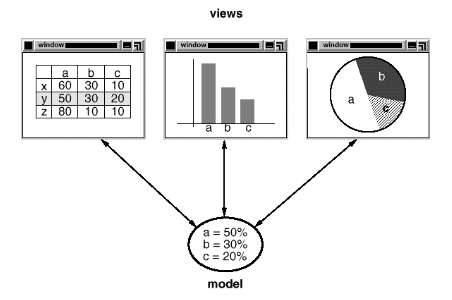

# Design Patterns

# 1.Introduction

:pushpin:**How does design pattern help?**

It aims to tackle Déjà Vu which you have solved a problem before but not knowing exactly where or how.

:pushpin:**Purpose of this Book**

The purpose of this book is to record **experience** in designing object-oriented software as **design patterns**.

:pushpin:**Design Pattern in Chinese**

将面向对象编程经验**可复用**的东西抽象成设计模式。

:smile:**Fun Fact**

The design pattern in Software Development actually was affected by an architect Christopher Alexander where he addressed that "*Each pattern describes a problem which occurs over and over again in our environment, and then **describes the core of the solution to that problem**, in such a way that you can **use this solution a million times over**, **without ever doing it the same way** twice*".

## 1.1. What Is a Design Pattern?

:pushpin: **4 essential elements** for a design pattern

- :one:**pattern name**, a handle to **describe** a design problem
- :two:**problem**, elaborate the problem with its context and include **a list of conditions to check** before applying design patterns(see if fits?)
- :three:**solution**
  - :heavy_check_mark:it is **an abstraction and template** to solve such problem(抽象结局方案)
  - :x: it is NOT a particular design or implementation(不具体实现) 
- :four:**consequence**, the result and **trade-off** applying such design pattern

:pushpin:**Design Pattern Definition(.fml)**

The design patterns are *description of communicating objects and classes that are customized to solve a general design problem in a particular context*.

## 1.2. Design Pattern in MVC

In this section, we take MVC as an example to see which kinds of design patterns it applied.

:pushpin:**What is MVC?**

MVC is <u>**Model / View / Controller**</u>.

> ​	The Model is the application object.

> ​	The View is its screen presentation. 

> ​	The Controller defines the way the user interface reacts to user input.

MVC **decouples** <u>views</u> and <u>models</u> by establishing a **subscribe/notify** protocol between them.

:pushpin:**Diagram of application used MVC**

:pushpin:**MVC & MVVM**

A great analogy is MVC and MVVM.

| MVC                                                          | MVVM                                                         |
| ------------------------------------------------------------ | ------------------------------------------------------------ |
| An architectural pattern                                     | A software architectural pattern                             |
| Model View Controller                                        | Model View ViewModel                                         |
| Model -> data View -> user interface Controller -> handles request | Model -> entities and domain objects View -> user interface layer View Model-> describes binding between view and model |
| Used by ASP.NET, Java, Spring                                | Used by Angular JS, Microsoft WPF                            |

From my point of view, the MVVM is a subset or an explicit implementation(实现) of MVC. MVC can be more abstract.

:pushpin:**What kinds of design pattern applied in MVC?**

<u>OBSERVER</u>: 

> ​	the methodology of observer is to **decouple objects** so that changes to one can affect any number of others without requiring the changed object to know details of the others.
>
> ​	e.g. The model and view is separated. If some data is changed in Model, the View can apply the changes to other views.

<u>COMPOSITE</u>:

> ​	the methodology of composite is to "**compose**" objects into **tree structures** to represent part-whole hierarchies.
>
> ​	e.g. create a big class including 
>
> ​			A. subclasses define primitive objects (e.g., Button)
>
> ​			B. other classes define composite objects (CompositeView) that **assemble the primitives into more complex objects**.

<u>STRATEGY</u>:

> ​	the methodology of strategy is to select an algorithm at runtime
>
> ​	e.g. a view can be disabled so that it doesn't accept input simply by giving it a controller that ignores input events.

## 1.3. Describing Design Patterns
