# Design Patterns


# 0.Principles of Object-Oriented Design

<div align="center">
<h3>Program to an interface, not an implementation.</h3>
<h3>Favor object composition over class inheritance.</h3>
</div>


# 1.Introduction

:pushpin:**How does design pattern help?**

It aims to tackle Déjà Vu which you have solved a problem before but not knowing exactly where or how.

:pushpin:**Purpose of this Book**

The purpose of this book is to record **experience** in designing object-oriented software as **design patterns**.

:pushpin:**Design Pattern in Chinese**

将面向对象编程经验**可复用**的东西抽象成设计模式。

:smile:**Fun Fact**

The design pattern in Software Development actually was affected by an architect Christopher Alexander where he addressed that "*Each pattern describes a problem which occurs over and over again in our environment, and then **describes the core of the solution to that problem**, in such a way that you can **use this solution a million times over**, **without ever doing it the same way** twice*".


## 1.1. What Is a Design Pattern?

:pushpin: **4 essential elements** for a design pattern

- :one:**pattern name**, a handle to **describe** a design problem
- :two:**problem**, elaborate the problem with its context and include **a list of conditions to check** before applying design patterns(see if fits?)
- :three:**solution**
  - :heavy_check_mark:it is **an abstraction and template** to solve such problem(抽象结局方案)
  - :x: it is NOT a particular design or implementation(不具体实现) 
- :four:**consequence**, the result and **trade-off** applying such design pattern


:pushpin:**Design Pattern Definition(.fml)**

The design patterns are *description of communicating objects and classes that are customized to solve a general design problem in a particular context*.


## 1.2. Design Pattern in MVC

In this section, we take MVC as an example to see which kinds of design patterns it applied.

:pushpin:**What is MVC?**

MVC is <u>**Model / View / Controller**</u>.

> ​	The Model is the application object.

> ​	The View is its screen presentation. 

> ​	The Controller defines the way the user interface reacts to user input.

MVC **decouples** <u>views</u> and <u>models</u> by establishing a **subscribe/notify** protocol between them.

:pushpin:**Diagram of application used MVC**

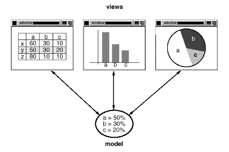

:pushpin:**MVC & MVVM**

A great analogy is MVC and MVVM.

| MVC                                                          | MVVM                                                         |
| ------------------------------------------------------------ | ------------------------------------------------------------ |
| An architectural pattern                                     | A software architectural pattern                             |
| Model View Controller                                        | Model View ViewModel                                         |
| Model -> data<br/>View -> user interface<br/>Controller -> handles request | Model -> entities and domain objects<br/>View -> user interface layer<br/>View Model-> describes binding between view and model |
| Used by ASP.NET, Java, Spring                                | Used by Angular JS, Microsoft WPF                            |

From my point of view, the MVVM is a subset or an explicit implementation(实现) of MVC. MVC can be more abstract.


:pushpin:**What kinds of design pattern applied in MVC?**

<u>OBSERVER</u>: 

> ​	the methodology of observer is to **decouple objects** so that changes to one can affect any number of others without requiring the changed object to know details of the others.
>
> ​	e.g. The model and view is separated. If some data is changed in Model, the View can apply the changes to other views.

<u>COMPOSITE</u>:

> ​	the methodology of composite is to "**compose**" objects into **tree structures** to represent part-whole hierarchies.
>
> ​	e.g. create a big class including 
>
> ​			A. subclasses define primitive objects (e.g., Button)
>
> ​			B. other classes define composite objects (CompositeView) that **assemble the primitives into more complex objects**.

<u>STRATEGY</u>:

> ​	the methodology of strategy is to select an algorithm at runtime
>
> ​	e.g. a view can be disabled so that it doesn't accept input simply by giving it a controller that ignores input events.


## 1.3. Describing Design Patterns:star:

The following is a template to describe design patterns in a unique sense.

:pushpin:**Pattern Name and Classification**

> ​	The name is the essence of the pattern.

:pushpin:**Intent**

> ​	A short description what does this pattern do?

:pushpin:**Also Known As**

> ​	Alias for this pattern (if any).

:pushpin:**Motivation**

> ​	A scenario that illustrates a design problem and how the class and object structures in the pattern solve the problem.

:pushpin:**Applicability**

> ​	What are the situations in which the design pattern can be applied?

:pushpin:**Structure**

> ​	A graphical representation of this design pattern.

:pushpin:**Participants**

> ​	The participated classes and/or objects and their responsibility.

:pushpin:**Collaborations**

> ​	How the participants work together?

:pushpin:**Consequences**

> ​	The trade-off and results.

:pushpin:**Implementation(实现)**

> ​	What pitfalls, hints, or techniques should be aware of implementing the pattern?

:pushpin:**Sample Code**

> ​	Code fragments

:pushpin:**Known Issues**

> ​	Examples

:pushpin:**Related Patterns**

> ​	The closest pattern to current one, what are their differences?


## 1.4. The Catalog of Design Patterns:star:

The following is the design patterns. //TODO write with your own words after finished this book,

:pushpin:**Abstract Factory**

> ​	Provide an interface for creating families of related or dependent objects without specifying their concrete classes.

:pushpin:**Adapter**

> ​	Convert the interface of a class into another interface clients expect. Adapter lets classes work together that couldn't otherwise because of incompatible interfaces.

:pushpin:**Bridge**

> ​	Decouple an abstraction from its implementation so that the two can vary independently.

:pushpin:**Builder**

> ​	Separate the construction of a complex object from its representation so that the same construction process can create different representations.

:pushpin:**Chain of Responsibility**

> ​	Avoid coupling the sender of a request to its receiver by giving more than one object a chance to handle the request. Chain the receiving objects and pass the request along the chain until an object handles it.

:pushpin:**Command**

> ​	Encapsulate a request as an object, thereby letting you parameterize clients with different requests, queue or log requests, and support undoable operations.

:pushpin:**Composite**

> ​	Compose objects into tree structures to represent part-whole hierarchies. Composite lets clients treat individual objects and compositions of objects uniformly.

:pushpin:**Decorator**

> ​	Attach additional responsibilities to an object dynamically. Decorators provide a flexible alternative to subclassing for extending functionality.

:pushpin:**Facade**

> ​	Provide a unified interface to a set of interfaces in a subsystem. Facade defines a higher-level interface that makes the subsystem easier to use.

:pushpin:**Factory Method**

> ​	Define an interface for creating an object, but let subclasses decide which class to instantiate. Factory Method lets a class defer instantiation to subclasses.

:pushpin:**Flyweight**

> ​	Use sharing to support large numbers of fine-grained objects efficiently.

:pushpin:**Interpreter**

> ​	Given a language, define a representation for its grammar along with an interpreter that uses the representation to interpret sentences in the language.

:pushpin:**Iterator**

> ​	Provide a way to access the elements of an aggregate object sequentially without exposing its underlying representation.

:pushpin:**Mediator**

> ​	Define an object that encapsulates how a set of objects interact. Mediator promotes loose coupling by keeping objects from referring to each other explicitly, and it lets you vary their interaction independently.

:pushpin:**Memento**

> ​	Without violating encapsulation, capture and externalize an object's internal state so that the object can be restored to this state later.

:pushpin:**Observer**

> ​	Define a one-to-many dependency between objects so that when one object changes state, all its dependents are notified and updated automatically.

:pushpin:**Prototype**

> ​	Specify the kinds of objects to create using a prototypical instance, and create new objects by copying this prototype.

:pushpin:**Proxy**

> ​	Provide a surrogate or placeholder for another object to control access to it.

:pushpin:**Singleton**

> ​	Ensure a class only has one instance, and provide a global point of access to it.

:pushpin:**State **

> ​	Allow an object to alter its behavior when its internal state changes. The object will appear to change its class.

:pushpin:**Strategy **

> ​	Define a family of algorithms, encapsulate each one, and make them interchangeable. Strategy lets the algorithm vary independently from clients that use it.

:pushpin:**Template Method**

> ​	Define the skeleton of an algorithm in an operation, deferring some steps to subclasses. Template Method lets subclasses redefine certain steps of an algorithm without changing the algorithm's structure.

:pushpin:**Visitor **

> ​	Represent an operation to be performed on the elements of an object structure. Visitor lets you define a new operation without changing the classes of the elements on which it operates.


## 1.5. Categorizing Design Patterns:star:

Categorizing the design patterns with certain rules is of tremendous importance. 

There are **2** criteria:

:one:**Purpose**, it reflects what a pattern does

- `creational patterns`, concern the process of object creation.

- `structural patterns`, deals with the composition of classes or objects
- `behavioral patterns`, characterize the interaction and responsibility of classes and objects

:two:**Scope**, it specifies whether the pattern applies to classes or objects

- `class patterns`, deal with relationship between classes and subclasses, they are static - fixed at runtime.
- `object patterns`, deal with object relationship, they are dynamic - changed at runtime.


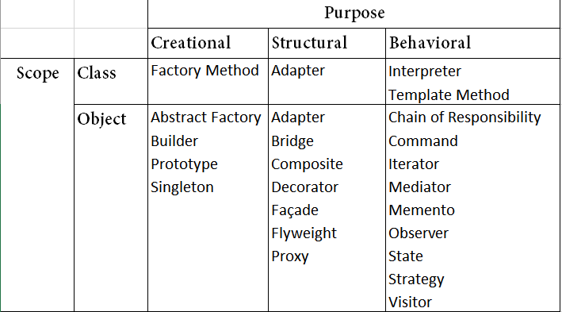


:pushpin:**How to see these patterns?**

The pattern can be defined as [Purpose]-[Scope]. 


:pushpin:**Example - interpret the pattern**

> ​	<u>Purpose</u> = Structural,

> ​	<u>Scope</u> = Class,

`Structural class` patterns use inheritance to **compose classes**.


> ​	<u>Purpose</u> = Structural,

> ​	<u>Scope</u> = Object,

`Structural object` patterns describe ways to **assemble objects**.


## 1.6. How Design Patterns Solve Design Problem

- `1.6.1.` illustrates what is an object (in abstraction, in configuration)
- `1.6.2.` defines how "abstract" the object is


### 1.6.1. Finding Appropriate Objects

:pushpin:**Why object is important?**

Object-oriented programs are made of objects.


:pushpin:**Insight of object**

In short, object's internal state is said to be **encapsulated**.

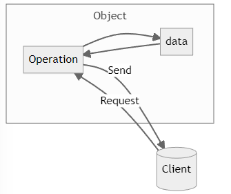


:pushpin:**Hard part of OOP**

It is HARD to **decompose a system into objects** in object-oriented design. Why is hard? It MUST take followings into consideration.

- encapsulation
- granularity
- dependency
- flexibility
- performance
- evolution
- reusability


:pushpin:**Design Pattern can help**

Design patterns help you to identify an appropriate object with abstraction.


### 1.6.2. Determining Object Granularity

:pushpin:**What is Granularity?**

Granularity is a level of details(LOD).  [颗粒度 in CHN]


:pushpin:**Why Granularity matters?**

It corresponds to memory-consuming. For example, you have the following in your program:

- trees in game landscape
- characters in document
- power points in cad application

If you will create separate object for each tree/character/power-point it could be very memory-consuming. Recall the days I played with Rendering and Forest in 3dsMax.


:pushpin:**Design Pattern can help**

It helps you decide what should be an object(in which level of details).


### 1.6.3. Specifying Object Interfaces

:pushpin:**What is signature?**

The signature is composed of <u>parameters</u> and <u>return types</u>.

```c++
int addOne(int num);
```


:pushpin:**What is interface?**

The **interface is the set of all the signatures defined by an object**. You can say this object supports following interface.


:pushpin:**What is a type?**

A type is a name used to **denote a particular interface**. We speak of an object as having the type "Elephant" if it accepts all requests for the operations defined in the interface named "Elephant".


:pushpin:**What is dynamic binding?**

The run-time association of a request to an object and one of its operations is known as dynamic binding.


:pushpin:**What is polymorphism?**

Dynamic binding lets you substitute objects that have identical interfaces for each other at run-time. This substitutability is known as polymorphism.


:pushpin:**Why polymorphism is important?**

Polymorphism simplifies the definitions of clients, decouples objects from each other, and lets them vary their relationships to each other at run-time. It is a :star:**KEY** concept in OOP.


:pushpin:**Why interface is important?**

You can only achieve polymorphism by interface.


:pushpin:**Design Pattern can help**

:one:Design patterns help you define interfaces by **identifying** their **key elements and the kinds of data** that get sent across an interface.

:two:Design patterns also **specify relationships** between interfaces.


### 1.6.4. Specifying Object Implementation

:pushpin:**Diagram of Class and Object**

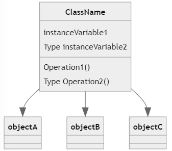

An object's implementation is defined by its **class**.

Object is said to be an **instance** of the class because they are created by **instantiating** a class.


:pushpin:**Class Inheritance**

The class inheritance describes a **<u>subclass</u> / <u>derived class</u>** inherits from a **<u>parent class</u> / <u>base class</u>**.

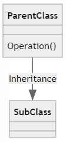


:pushpin:**Abstract class and Concrete class**

<u>Abstract class</u>: its main purpose is to **define a common interface** for its subclasses. (it does not have to implement all the operations)

<u>Concrete class</u>: the complement of abstract class is concrete class. (the interface must be implemented!)

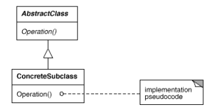

Therefore, you can implement the operation defined by *abstract class* elsewhere. 


:pushpin:**Mixin Class**

A **mixin** (or **mix-in**) is a class that contains methods for use by other classes without having to be the parent class of those other classes. 

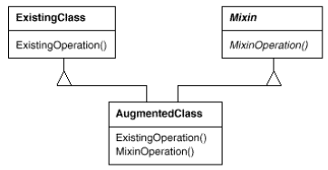


:pushpin:**<u>Class Inheritance</u> VS <u>Interface Inheritance</u>**

Personally, I think the design of C# illustrating these concepts very well.

> ​	**<u>Class inheritance</u>** defines an object's implementation in terms of another object's implementation. In short, it's a mechanism for **code and representation sharing**. 

> ​	<u>**Interface inheritance**</u> (or subtyping) describes when an object can be used in place of another.

//TODO a diagram illustrating this would be better.


:pushpin:**Program to an interface, not an implementation**:star::star::star:

> ​	This is super IMPORTANT!! PLEASE KEEP IT IN MIND!!!

Don't declare variables to be instances of particular concrete classes. Instead, commit only to an interface defined by an abstract class. 


> ​	Example of Programming to an interface:heavy_check_mark:

```c++
//Base class specifying the interface
class Calculator
{
protected:
	double g_num;

public:
	virtual double AddOperation(double value);
};

//Derived class implementing the interface
class NewCalculator : public Calculator
{
public:
	double AddOperation(double value) override
	{
		this->g_num += value;
	}
};

//Derived class implementing the interface
class OldeCalculator : public Calculator
{
public:
	double AddOperation(double value) override
	{
		this->g_num += value + value;
	}
};
```


> ​	Example of Programming to an implementation:x:

```c++
class Calculator
{
private:
	double g_num;

public:
	double AddOperation(double value)
	{
		this->g_num++;
	}
};
```


:star:The former one is **BETTER** because **polymorphism** depends on it.


:pushpin:**Why Design patter can help?**

The <u>**creational patterns**</u> help you in specifying the particular implementation of those interfaces somewhere in your system. They are *Abstract Factory*, *Builder*, *Factory Method*, *Prototype*, and *Singleton*.


### 1.6.5. Putting Reuse Mechanisms to Work

:pushpin:**Inheritance versus Composition**

In short, you should use *composition* more than *inheritance*!!

> ​	**Inheritance - [White Box]:white_large_square:**

If inherited implementation **not be appropriate** for new problem, the parent class **must be rewritten**!!

> ​	 **Composition - [Black Box]:black_large_square:**

New functionality is obtained by **assembling** or **composing** <u>**objects**</u> to get more complex functionality. Object composition requires that the objects being composed have well-defined interfaces.


I think **intuitive** understanding is even better than text explanation.

<div align="center">
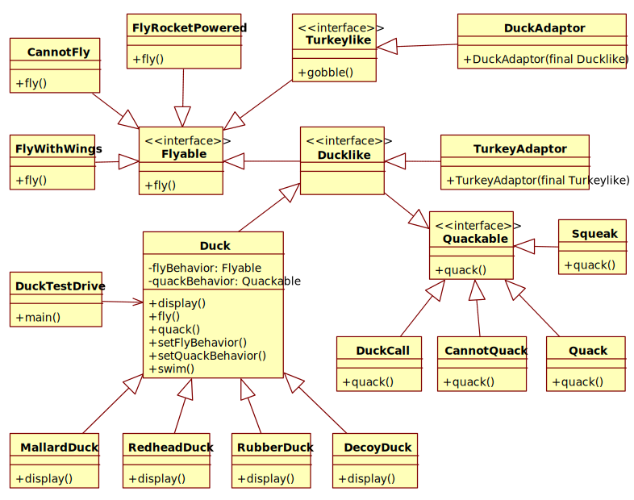
  <figcaption>Diagram of Composition</figcaption>
    <br></br>
    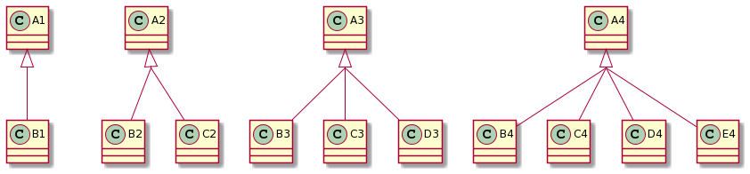
  <figcaption>Diagram of Inheritance</figcaption>
</div>

Composition is way more flexible than inheritance.


:pushpin:**Aggregation vs. Acquaintance**

|                                               | Aggregation                              | Acquaintance                             |
| --------------------------------------------- | ---------------------------------------- | ---------------------------------------- |
| Relationship between objects and owners[DIFF] | close, tight                             | loose, weaker                            |
| Lifetime[DIFF]                                | have identical lifetimes                 | not responsible for each other           |
| Intention[DIFF]                               | permanent                                | dynamic                                  |
| Language Mechanism[COMMON]                    | implemented with pointers and references | implemented with pointers and references |


:pushpin:**Why Design patter can help?**

Because aggregation and acquaintance are often related to **compile-time** and **run-time**. Therefore, many design patterns (in particular those that have object scope) capture the distinction between compile-time and run-time structures explicitly. 


### 1.6.6. Designing for Change

:pushpin:**Change**

Change is fxxking everywhere. You know that.


:pushpin:**Why Design patter can help?**

Design patterns help you avoid this by ensuring that **a ROBUST system can change in specific ways**. 


:pushpin:**Common Causes of Redesign** :star::star::star:

The following are the common causes of redesign in Software Development.

> ​	:one:*Creating an object by specifying a class explicitly*:x:

**Description:page_facing_up:** Specifying a class name when you create an object commits you to a particular implementation rather than a particular interface.

**Solution**:heavy_check_mark:: create objects indirectly by [Abstract Factory][iAbstract Factory] ,  [Factory Method][iFactory Method],   [Prototype][iPrototype]


> ​	:two:*Dependence on specific operations*:x:

**Description:page_facing_up:** Commit one way and hardcode of satisfying a request.

**Solution**:heavy_check_mark::   create dynamic request at compile-time and at run-time by [Chain of Responsibility][iChain of Responsibility] [Command][iCommand ]


> ​	:three:*Dependence on hardware and software platform*:x:

**Description:page_facing_up:** (You know that)

**Solution**:heavy_check_mark: : design system not to limit its on platform by [Abstract Factory][iAbstract Factory],  [Bridge][iBridge]


> ​	:four:*Dependence on object representations or implementations*:x:

**Description:page_facing_up:** Clients that know how an object is represented, stored, located, or implemented might need to be changed when the object changes. Hiding this information from clients keeps changes from cascading!:star: (若客户知道一个obj怎么表达，他肯定会根据这个"表达"来修改，因此我们需要隐藏这个"表达"，越抽象越好)。

**Solution**:heavy_check_mark:: You can make these objects more abstract by  [Abstract Factory][iAbstract Factory] ,[Bridge ][iBridge], [Memento][iMemento ], [Proxy][iProxy ]


> ​	:five:*Algorithmic dependencies*:x:

**Description:page_facing_up:** :  Algorithms always change. Objects that depend on an algorithm therefore change.

**Solution**:heavy_check_mark:: Algorithms that are likely to change should be isolated by [Builder][iBuilder], [Iterator][iIterator], [Strategy][iStrategy], [Template Method][iTemplate Method], [Visitor][iVisitor]


> ​	:six:*Tight coupling*:x:

**Description:page_facing_up:** :  Classes that are tightly coupled are hard to reuse in isolation.

**Solution**:heavy_check_mark:: Develop loosely coupled systems by [Abstract Factory][iAbstract Factory], [Bridge][iAbstract Factory], [Chain of Responsibility][iChain of Responsibility], [Command][iCommand], [Facade][iFacade], [Mediator][iMediator], [Observer][iObserver]


> ​	:seven:*Extending functionality by subclassing*:x:

**Description:page_facing_up:** :  Customizing an object by subclassing is **HARD**. Every new class has a **fixed** implementation overhead (initialization, finalization, etc.). Defining a subclass also **requires** an in-depth understanding of the parent class.

**Solution**:heavy_check_mark:: You can use <u>**object composition**</u> in general and **<u>delegation</u>** in particular provide flexible alternatives to inheritance for combining behavior. by [Bridge][iBridge], [Chain of Responsibility][iChain of Responsibility], [Composite][iComposite], [Decorator][iDecorator], [Observer][iObserver], [Strategy][iStrategy]


> ​	:eight:*Inability to alter classes conveniently*:x:

**Description:page_facing_up:** :  Imagine you have to modify a class that can't be modified conveniently because the class is for commercial target.

**Solution**:heavy_check_mark:: You can solve this by [Adapter][iAdapter], [Decorator][iDecorator], [Visitor][iVisitor]


:pushpin:**Changes in 3 classes of software**

> ​	:one:*application programs*

required generalization+

required flexibility+

e.g. standalone software

> ​	:two:*toolkits*

required generalization++

required flexibility++

e.g. libigl

> ​	:three:*frameworks*

required generalization+++

required flexibility+++

e.g. Unreal Engine, NET Framework


## 1.7. How to Select a Design Pattern

Within more than 20 design patterns, it's hard to choose among them. The followings are the approach can help you choose the Design Pattern.

:pushpin:**Consider how design patterns solve design PROBLEMS**

Refer to section 1.6.,

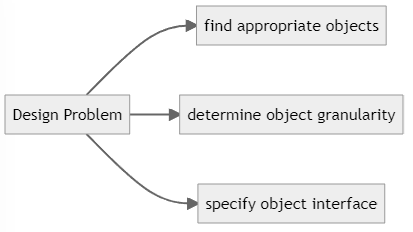


:pushpin:**Scan Intent Section**

- Quickly scan the intent in [1.4.][#14-the-catalog-of-design-patternsstar] , find the appropriate one.
- Narrow the search by table in [1.5.][#15-categorizing-design-patternsstar]


:pushpin:**Study how patterns interrelate**

Refer the relational graph in [1.6.][#16-how-design-patterns-solve-design-problem]  , it will help you understand the relationship in a bigger picture.


:pushpin:**Study patterns of like purpose**

Read the essential **intro** of each categories of patterns. :star: 

- [Creational][#3creational-patterns]
- [Structural][#4structural-patterns]
- [Behavioral][#5behavioral-patterns]


:pushpin:**Examine a cause of redesign**

When you are **frustrated by a redesign** problem, refer to page [24][#166-designing-for-change] to **avoid causes of redesign**.


:pushpin:**Identify the VARIABLE in your design**

Rather than focusing on the causes of redesign, find the "**changes**" instead! The following is a table highlighting those variables.

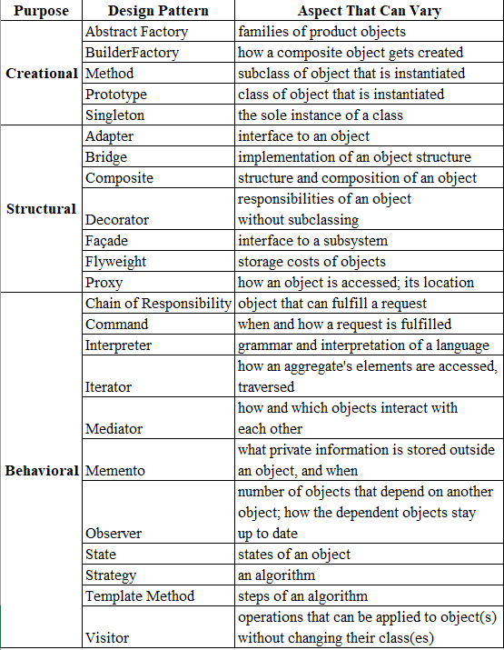


## 1.8. How to Use a Design Pattern

:pushpin:**1.Read the overview:eyes:**

Read the pattern once through for an overview. Pay particular **attention** to the **<u>Applicability</u>** and **<u>Consequences</u>** sections to ensure the pattern is right for your problem.


:pushpin:**2.Study the structure, participants, and collaboration section**

Make sure you **understand** the **classes** and **objects** in the pattern and **<u>how they relate</u>** to one another.


:pushpin:**3.Sample Code**

Studying the code **helps you** learn **how to implement the pattern**.


:pushpin:**4.Choose NAME for pattern participants**

Choose names for pattern participants that are **meaningful in** the application **context**. That **helps** make the pattern more explicit in the **implementation**.


:pushpin:**5.Define the classes**

Declare their **interfaces**, establish their **inheritance relationships**.

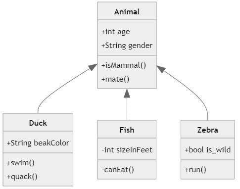

Define the instance variables that represent **data** and **object references**. 


**Identify existing classes** in your application that the pattern will affect, and **modify them** accordingly.


:pushpin:**6.Define <u>application-specific</u> names for operation**

**Denote** the operation in light of <u>responsibilities</u> and <u>collaborations</u>. 

Be **consistent** in your **naming conventions**. For example, you might use the "Create-" prefix consistently to denote a factory method.


:pushpin:**7.Implement the operations**

Implement the operations to carry out their **responsibilities** and **collaborations** defined in the pattern.


# 2.A Case Study: Design a Document Editor


:pushpin:****


:pushpin:****


:pushpin:****


:pushpin:****


:pushpin:****


:pushpin:****


:pushpin:****


:pushpin:****


:pushpin:****


:pushpin:****


:pushpin:****


:pushpin:****


:pushpin:****


:pushpin:****


:pushpin:****


:pushpin:****


:pushpin:****


:pushpin:****


:pushpin:****


:pushpin:****


:pushpin:****


:pushpin:****


:pushpin:****


:pushpin:****


:pushpin:****


:pushpin:****


:pushpin:****


:pushpin:****


:pushpin:****


:pushpin:****


:pushpin:****


:pushpin:****


:pushpin:****


:pushpin:****


:pushpin:****


:pushpin:****


:pushpin:****


:pushpin:****


:pushpin:****


:pushpin:****


:pushpin:****


:pushpin:****


:pushpin:****


:pushpin:****


:pushpin:****


:pushpin:****


:pushpin:****


:pushpin:****


:pushpin:****


:pushpin:****


:pushpin:****


:pushpin:****


:pushpin:****


:pushpin:****


:pushpin:****


:pushpin:****


:pushpin:****


:pushpin:****


:pushpin:****


:pushpin:****


:pushpin:****


:pushpin:****


:pushpin:****


:pushpin:****


:pushpin:****


:pushpin:****


:pushpin:****


:pushpin:****


:pushpin:****


:pushpin:****


:pushpin:****


:pushpin:****


:pushpin:****


:pushpin:****


:pushpin:****


:pushpin:****


:pushpin:****


:pushpin:****


:pushpin:****


:pushpin:****


:pushpin:****


:pushpin:****


:pushpin:****


:pushpin:****


:pushpin:****


:pushpin:****


:pushpin:****


:pushpin:****


:pushpin:****


:pushpin:****


:pushpin:****


:pushpin:****


:pushpin:****


:pushpin:****


:pushpin:****


:pushpin:****


:pushpin:****


:pushpin:****


:pushpin:****


:pushpin:****


:pushpin:****


:pushpin:****


:pushpin:****


:pushpin:****


:pushpin:****


:pushpin:****


:pushpin:****


:pushpin:****


:pushpin:****


:pushpin:****


:pushpin:****


:pushpin:****


:pushpin:****


:pushpin:****


:pushpin:****


:pushpin:****


:pushpin:****


:pushpin:****


:pushpin:****


:pushpin:****


:pushpin:****


:pushpin:****


:pushpin:****


:pushpin:****


:pushpin:****


:pushpin:****


:pushpin:****


:pushpin:****


:pushpin:****


:pushpin:****


:pushpin:****


:pushpin:****


:pushpin:****


:pushpin:****


:pushpin:****


:pushpin:****


:pushpin:****


:pushpin:****


:pushpin:****


:pushpin:****


:pushpin:****


:pushpin:****


:pushpin:****


:pushpin:****


:pushpin:****


:pushpin:****


:pushpin:****


:pushpin:****


:pushpin:****


:pushpin:****


:pushpin:****


:pushpin:****


:pushpin:****


:pushpin:****


:pushpin:****


:pushpin:****


:pushpin:****


:pushpin:****


:pushpin:****


:pushpin:****


:pushpin:****


:pushpin:****


:pushpin:****


:pushpin:****


:pushpin:****


:pushpin:****


:pushpin:****


:pushpin:****


:pushpin:****


:pushpin:****


:pushpin:****


:pushpin:****


:pushpin:****


:pushpin:****


:pushpin:****


:pushpin:****


:pushpin:****


:pushpin:****


:pushpin:****


:pushpin:****


:pushpin:****


:pushpin:****


:pushpin:****


:pushpin:****


:pushpin:****


:pushpin:****


:pushpin:****


:pushpin:****


:pushpin:****


:pushpin:****


:pushpin:****


:pushpin:****


:pushpin:****


:pushpin:****


:pushpin:****


:pushpin:****


:pushpin:****


:pushpin:****


:pushpin:****


:pushpin:****


:pushpin:****


:pushpin:****


:pushpin:****


:pushpin:****


:pushpin:****


:pushpin:****


:pushpin:****


:pushpin:****


:pushpin:****


:pushpin:****


:pushpin:****


:pushpin:****


:pushpin:****


:pushpin:****


:pushpin:****


:pushpin:****


:pushpin:****


:pushpin:****


:pushpin:****


:pushpin:****


:pushpin:****


:pushpin:****


:pushpin:****


:pushpin:****


:pushpin:****


:pushpin:****


:pushpin:****


:pushpin:****


:pushpin:****


:pushpin:****


:pushpin:****


:pushpin:****


:pushpin:****


:pushpin:****


:pushpin:****


:pushpin:****


:pushpin:****


:pushpin:****


:pushpin:****


:pushpin:****


:pushpin:****


:pushpin:****


:pushpin:****


:pushpin:****


:pushpin:****


:pushpin:****


:pushpin:****


:pushpin:****


:pushpin:****


:pushpin:****


:pushpin:****


:pushpin:****


:pushpin:****


:pushpin:****


:pushpin:****


:pushpin:****


:pushpin:****


:pushpin:****


:pushpin:****


:pushpin:****


:pushpin:****


:pushpin:****


:pushpin:****


:pushpin:****


:pushpin:****


:pushpin:****


:pushpin:****


:pushpin:****


:pushpin:****


:pushpin:****


:pushpin:****


:pushpin:****


:pushpin:****


:pushpin:****


:pushpin:****


:pushpin:****


:pushpin:****


:pushpin:****


:pushpin:****


:pushpin:****


:pushpin:****


:pushpin:****


:pushpin:****


:pushpin:****


:pushpin:****


:pushpin:****


:pushpin:****


:pushpin:****


:pushpin:****


:pushpin:****


:pushpin:****


:pushpin:****


:pushpin:****


:pushpin:****


:pushpin:****


:pushpin:****


:pushpin:****


:pushpin:****


:pushpin:****


:pushpin:****


:pushpin:****


:pushpin:****


:pushpin:****


:pushpin:****


:pushpin:****


:pushpin:****


:pushpin:****


:pushpin:****


:pushpin:****


:pushpin:****


:pushpin:****


:pushpin:****


:pushpin:****


:pushpin:****


:pushpin:****


:pushpin:****


:pushpin:****


:pushpin:****


:pushpin:****


:pushpin:****


:pushpin:****


:pushpin:****


:pushpin:****


:pushpin:****


:pushpin:****


:pushpin:****


:pushpin:****


:pushpin:****


:pushpin:****


:pushpin:****


:pushpin:****


:pushpin:****


:pushpin:****


:pushpin:****


:pushpin:****


:pushpin:****


:pushpin:****


:pushpin:****


:pushpin:****


:pushpin:****


:pushpin:****


:pushpin:****


:pushpin:****


:pushpin:****


:pushpin:****


:pushpin:****


:pushpin:****


:pushpin:****


:pushpin:****


:pushpin:****


:pushpin:****


:pushpin:****


:pushpin:****


:pushpin:****


:pushpin:****


:pushpin:****


:pushpin:****


:pushpin:****


:pushpin:****


:pushpin:****


:pushpin:****


:pushpin:****


:pushpin:****


:pushpin:****


:pushpin:****


:pushpin:****


:pushpin:****


:pushpin:****


:pushpin:****


:pushpin:****


:pushpin:****


:pushpin:****


:pushpin:****


:pushpin:****


:pushpin:****


:pushpin:****


:pushpin:****


:pushpin:****


:pushpin:****


:pushpin:****


:pushpin:****


:pushpin:****


:pushpin:****


:pushpin:****


:pushpin:****


:pushpin:****


:pushpin:****


:pushpin:****


:pushpin:****


:pushpin:****


:pushpin:****


:pushpin:****


:pushpin:****


:pushpin:****


:pushpin:****


:pushpin:****


:pushpin:****


:pushpin:****


:pushpin:****


:pushpin:****


:pushpin:****


:pushpin:****


:pushpin:****


:pushpin:****


:pushpin:****


:pushpin:****


:pushpin:****


:pushpin:****


:pushpin:****


:pushpin:****


:pushpin:****


:pushpin:****


:pushpin:****


:pushpin:****


:pushpin:****


:pushpin:****


:pushpin:****


:pushpin:****


:pushpin:****


:pushpin:****


:pushpin:****


:pushpin:****


:pushpin:****


:pushpin:****


:pushpin:****


:pushpin:****


:pushpin:****


:pushpin:****


:pushpin:****


:pushpin:****


:pushpin:****


:pushpin:****


:pushpin:****


:pushpin:****


:pushpin:****


:pushpin:****


:pushpin:****


:pushpin:****


:pushpin:****


:pushpin:****


:pushpin:****


:pushpin:****


:pushpin:****


:pushpin:****


:pushpin:****


:pushpin:****


:pushpin:****


:pushpin:****


:pushpin:****


:pushpin:****


:pushpin:****


:pushpin:****


:pushpin:****


:pushpin:****


:pushpin:****


:pushpin:****


:pushpin:****


:pushpin:****


:pushpin:****


:pushpin:****


:pushpin:****


:pushpin:****


:pushpin:****


:pushpin:****


:pushpin:****


:pushpin:****


:pushpin:****


:pushpin:****


:pushpin:****


:pushpin:****


:pushpin:****


:pushpin:****


:pushpin:****


:pushpin:****


:pushpin:****


:pushpin:****


:pushpin:****


:pushpin:****


:pushpin:****


:pushpin:****


:pushpin:****


:pushpin:****


:pushpin:****


:pushpin:****


:pushpin:****


:pushpin:****


:pushpin:****


:pushpin:****


:pushpin:****


:pushpin:****


:pushpin:****


:pushpin:****


:pushpin:****


:pushpin:****


:pushpin:****


:pushpin:****


:pushpin:****


:pushpin:****


:pushpin:****


:pushpin:****


:pushpin:****


:pushpin:****


:pushpin:****


:pushpin:****


:pushpin:****


:pushpin:****


:pushpin:****


:pushpin:****


:pushpin:****


:pushpin:****


:pushpin:****


:pushpin:****


:pushpin:****


:pushpin:****


:pushpin:****


:pushpin:****


:pushpin:****


:pushpin:****


:pushpin:****


:pushpin:****


:pushpin:****


:pushpin:****


:pushpin:****


:pushpin:****


:pushpin:****


:pushpin:****


:pushpin:****


:pushpin:****


:pushpin:****


:pushpin:****


:pushpin:****


:pushpin:****


:pushpin:****


:pushpin:****


:pushpin:****


:pushpin:****


:pushpin:****


:pushpin:****


:pushpin:****


:pushpin:****


:pushpin:****


:pushpin:****


:pushpin:****


:pushpin:****


:pushpin:****


:pushpin:****


:pushpin:****


:pushpin:****


:pushpin:****


:pushpin:****


:pushpin:****


:pushpin:****


:pushpin:****


:pushpin:****


:pushpin:****


:pushpin:****


:pushpin:****


:pushpin:****


:pushpin:****


:pushpin:****


:pushpin:****


:pushpin:****


:pushpin:****


:pushpin:****


:pushpin:****


:pushpin:****


:pushpin:****


:pushpin:****


:pushpin:****


:pushpin:****


:pushpin:****


:pushpin:****


:pushpin:****


:pushpin:****


:pushpin:****


:pushpin:****


:pushpin:****


:pushpin:****


:pushpin:****


:pushpin:****


:pushpin:****


:pushpin:****


:pushpin:****


:pushpin:****


:pushpin:****


:pushpin:****


:pushpin:****


:pushpin:****


:pushpin:****


:pushpin:****


:pushpin:****


:pushpin:****


:pushpin:****


:pushpin:****


:pushpin:****


:pushpin:****


:pushpin:****


:pushpin:****


:pushpin:****


:pushpin:****


:pushpin:****


:pushpin:****


:pushpin:****


:pushpin:****


:pushpin:****


:pushpin:****


:pushpin:****


:pushpin:****


:pushpin:****


:pushpin:****


:pushpin:****


:pushpin:****


:pushpin:****


:pushpin:****


:pushpin:****


:pushpin:****


:pushpin:****


:pushpin:****


:pushpin:****


:pushpin:****


:pushpin:****


:pushpin:****


:pushpin:****


:pushpin:****


:pushpin:****


:pushpin:****


:pushpin:****


:pushpin:****


:pushpin:****


:pushpin:****


:pushpin:****


:pushpin:****


:pushpin:****


:pushpin:****


:pushpin:****


:pushpin:****


:pushpin:****


:pushpin:****


:pushpin:****


:pushpin:****


:pushpin:****


:pushpin:****


:pushpin:****


:pushpin:****


:pushpin:****


:pushpin:****


:pushpin:****


:pushpin:****


:pushpin:****


:pushpin:****


:pushpin:****


:pushpin:****


:pushpin:****


:pushpin:****


:pushpin:****


:pushpin:****


:pushpin:****


:pushpin:****


:pushpin:****


:pushpin:****


:pushpin:****


:pushpin:****


:pushpin:****


:pushpin:****


:pushpin:****


:pushpin:****


:pushpin:****


:pushpin:****


:pushpin:****


:pushpin:****


:pushpin:****


:pushpin:****


:pushpin:****


:pushpin:****


:pushpin:****


:pushpin:****


:pushpin:****


:pushpin:****


:pushpin:****


:pushpin:****


:pushpin:****


:pushpin:****


:pushpin:****


:pushpin:****


:pushpin:****


:pushpin:****


:pushpin:****


:pushpin:****


:pushpin:****


:pushpin:****


:pushpin:****


:pushpin:****


:pushpin:****


:pushpin:****


:pushpin:****


:pushpin:****


:pushpin:****


:pushpin:****


:pushpin:****


:pushpin:****


:pushpin:****


:pushpin:****


:pushpin:****


:pushpin:****


:pushpin:****


:pushpin:****


:pushpin:****


:pushpin:****


:pushpin:****


:pushpin:****


:pushpin:****


:pushpin:****


:pushpin:****


:pushpin:****


:pushpin:****


:pushpin:****


:pushpin:****


:pushpin:****


:pushpin:****


:pushpin:****


:pushpin:****


:pushpin:****


:pushpin:****


:pushpin:****


:pushpin:****


:pushpin:****


:pushpin:****


:pushpin:****


:pushpin:****


:pushpin:****


:pushpin:****


:pushpin:****


:pushpin:****


:pushpin:****


:pushpin:****


:pushpin:****


:pushpin:****


:pushpin:****


:pushpin:****


:pushpin:****


:pushpin:****


:pushpin:****


:pushpin:****


:pushpin:****


:pushpin:****


:pushpin:****


:pushpin:****


:pushpin:****


:pushpin:****


:pushpin:****


:pushpin:****


:pushpin:****


:pushpin:****


:pushpin:****


:pushpin:****


:pushpin:****


:pushpin:****


:pushpin:****


:pushpin:****


:pushpin:****


:pushpin:****


:pushpin:****


:pushpin:****


:pushpin:****


:pushpin:****


:pushpin:****


:pushpin:****


:pushpin:****


:pushpin:****


:pushpin:****


:pushpin:****


:pushpin:****


:pushpin:****


:pushpin:****


:pushpin:****


:pushpin:****


:pushpin:****


:pushpin:****


:pushpin:****


:pushpin:****


:pushpin:****


:pushpin:****


:pushpin:****


:pushpin:****


:pushpin:****


:pushpin:****


:pushpin:****


:pushpin:****


:pushpin:****


:pushpin:****


:pushpin:****


:pushpin:****


:pushpin:****


:pushpin:****


:pushpin:****


:pushpin:****


:pushpin:****


:pushpin:****


:pushpin:****


:pushpin:****


:pushpin:****


:pushpin:****


:pushpin:****


:pushpin:****


:pushpin:****


:pushpin:****


:pushpin:****


:pushpin:****


:pushpin:****


:pushpin:****


:pushpin:****


:pushpin:****


:pushpin:****


:pushpin:****


:pushpin:****


:pushpin:****


:pushpin:****


:pushpin:****


:pushpin:****


:pushpin:****


:pushpin:****


:pushpin:****


:pushpin:****


:pushpin:****


:pushpin:****


:pushpin:****


:pushpin:****


:pushpin:****


:pushpin:****


:pushpin:****


:pushpin:****


:pushpin:****


:pushpin:****


:pushpin:****


:pushpin:****


:pushpin:****


:pushpin:****


:pushpin:****


:pushpin:****


:pushpin:****


:pushpin:****


:pushpin:****


:pushpin:****


:pushpin:****


:pushpin:****


:pushpin:****


:pushpin:****


:pushpin:****


:pushpin:****


:pushpin:****


:pushpin:****


:pushpin:****


:pushpin:****


:pushpin:****


:pushpin:****


:pushpin:****


:pushpin:****


:pushpin:****


:pushpin:****


:pushpin:****


:pushpin:****


:pushpin:****


:pushpin:****


:pushpin:****


:pushpin:****


:pushpin:****


:pushpin:****


:pushpin:****


:pushpin:****


:pushpin:****


:pushpin:****


:pushpin:****


:pushpin:****


:pushpin:****


:pushpin:****


:pushpin:****


:pushpin:****


:pushpin:****


:pushpin:****


:pushpin:****


:pushpin:****


:pushpin:****


:pushpin:****


:pushpin:****


:pushpin:****


:pushpin:****


:pushpin:****


:pushpin:****


:pushpin:****


:pushpin:****


:pushpin:****


:pushpin:****


:pushpin:****


:pushpin:****


:pushpin:****


:pushpin:****


:pushpin:****


:pushpin:****


:pushpin:****


:pushpin:****


:pushpin:****


:pushpin:****


:pushpin:****


:pushpin:****


:pushpin:****


:pushpin:****


:pushpin:****


:pushpin:****


:pushpin:****


:pushpin:****


:pushpin:****


:pushpin:****


:pushpin:****


:pushpin:****


:pushpin:****


:pushpin:****


:pushpin:****


:pushpin:****


:pushpin:****


:pushpin:****


:pushpin:****


:pushpin:****


:pushpin:****


:pushpin:****


:pushpin:****


:pushpin:****


:pushpin:****


:pushpin:****


:pushpin:****


:pushpin:****


:pushpin:****


:pushpin:****


:pushpin:****


:pushpin:****


:pushpin:****


:pushpin:****


:pushpin:****


:pushpin:****


:pushpin:****


:pushpin:****


:pushpin:****


:pushpin:****


:pushpin:****


:pushpin:****


:pushpin:****


:pushpin:****


:pushpin:****


:pushpin:****


:pushpin:****


:pushpin:****


:pushpin:****


:pushpin:****


:pushpin:****


:pushpin:****


:pushpin:****


:pushpin:****


:pushpin:****


:pushpin:****


:pushpin:****


:pushpin:****


:pushpin:****


:pushpin:****


:pushpin:****


:pushpin:****


:pushpin:****


:pushpin:****


:pushpin:****


:pushpin:****


:pushpin:****


:pushpin:****


:pushpin:****


:pushpin:****


:pushpin:****


:pushpin:****


:pushpin:****


:pushpin:****


:pushpin:****


:pushpin:****


:pushpin:****


:pushpin:****


:pushpin:****


:pushpin:****


:pushpin:****


:pushpin:****


:pushpin:****


:pushpin:****


:pushpin:****


:pushpin:****


:pushpin:****


:pushpin:****


:pushpin:****


:pushpin:****


:pushpin:****


:pushpin:****


:pushpin:****


:pushpin:****


:pushpin:****


:pushpin:****


:pushpin:****


:pushpin:****


:pushpin:****


:pushpin:****


:pushpin:****


:pushpin:****


:pushpin:****


:pushpin:****


:pushpin:****


:pushpin:****


:pushpin:****


:pushpin:****


:pushpin:****


:pushpin:****


:pushpin:****


:pushpin:****


:pushpin:****


:pushpin:****


:pushpin:****


:pushpin:****


:pushpin:****


:pushpin:****


:pushpin:****


:pushpin:****


:pushpin:****


:pushpin:****


:pushpin:****


:pushpin:****


:pushpin:****


:pushpin:****


:pushpin:****


:pushpin:****


:pushpin:****


:pushpin:****


:pushpin:****


:pushpin:****


:pushpin:****


:pushpin:****


:pushpin:****


:pushpin:****


:pushpin:****


:pushpin:****


:pushpin:****


:pushpin:****


:pushpin:****


:pushpin:****


:pushpin:****


:pushpin:****


:pushpin:****


:pushpin:****


:pushpin:****


:pushpin:****


:pushpin:****


:pushpin:****


:pushpin:****


:pushpin:****


:pushpin:****


:pushpin:****


:pushpin:****


:pushpin:****


:pushpin:****


:pushpin:****


:pushpin:****


:pushpin:****


:pushpin:****


:pushpin:****


:pushpin:****


:pushpin:****


:pushpin:****


:pushpin:****


:pushpin:****


:pushpin:****


:pushpin:****


:pushpin:****


:pushpin:****


:pushpin:****


:pushpin:****


:pushpin:****


:pushpin:****


:pushpin:****


:pushpin:****


:pushpin:****


:pushpin:****


:pushpin:****


:pushpin:****


:pushpin:****


:pushpin:****


:pushpin:****


:pushpin:****


:pushpin:****


:pushpin:****


:pushpin:****


:pushpin:****


:pushpin:****


:pushpin:****


:pushpin:****


:pushpin:****


:pushpin:****


:pushpin:****


:pushpin:****


:pushpin:****


:pushpin:****


:pushpin:****


:pushpin:****


:pushpin:****


:pushpin:****


:pushpin:****


:pushpin:****


:pushpin:****


:pushpin:****


:pushpin:****


:pushpin:****


:pushpin:****


:pushpin:****


:pushpin:****


:pushpin:****


:pushpin:****


:pushpin:****


:pushpin:****


:pushpin:****


:pushpin:****


:pushpin:****


:pushpin:****


:pushpin:****


:pushpin:****


:pushpin:****


:pushpin:****


:pushpin:****


:pushpin:****


:pushpin:****


:pushpin:****


:pushpin:****


:pushpin:****


:pushpin:****


:pushpin:****


:pushpin:****


:pushpin:****


:pushpin:****


:pushpin:****


:pushpin:****


:pushpin:****


:pushpin:****


:pushpin:****


:pushpin:****


:pushpin:****


:pushpin:****


:pushpin:****


:pushpin:****


:pushpin:****


:pushpin:****


:pushpin:****


:pushpin:****


:pushpin:****


:pushpin:****


:pushpin:****


:pushpin:****


:pushpin:****


:pushpin:****


:pushpin:****


:pushpin:****


:pushpin:****


:pushpin:****


:pushpin:****


:pushpin:****


:pushpin:****


:pushpin:****


:pushpin:****


:pushpin:****


:pushpin:****


:pushpin:****


:pushpin:****


:pushpin:****


:pushpin:****


:pushpin:****


:pushpin:****


:pushpin:****


:pushpin:****


:pushpin:****


:pushpin:****


:pushpin:****


:pushpin:****


:pushpin:****


:pushpin:****


:pushpin:****


:pushpin:****


:pushpin:****


:pushpin:****


:pushpin:****


:pushpin:****


:pushpin:****


:pushpin:****


:pushpin:****


:pushpin:****


:pushpin:****


:pushpin:****


:pushpin:****


:pushpin:****


:pushpin:****


:pushpin:****


:pushpin:****


:pushpin:****


:pushpin:****


:pushpin:****


:pushpin:****


:pushpin:****


:pushpin:****


:pushpin:****


:pushpin:****


:pushpin:****


:pushpin:****


:pushpin:****


:pushpin:****


:pushpin:****


:pushpin:****


:pushpin:****


:pushpin:****


:pushpin:****


:pushpin:****


:pushpin:****


:pushpin:****


:pushpin:****


:pushpin:****


:pushpin:****


:pushpin:****


:pushpin:****


:pushpin:****


:pushpin:****


:pushpin:****


:pushpin:****


:pushpin:****


:pushpin:****


:pushpin:****


:pushpin:****


:pushpin:****


:pushpin:****


:pushpin:****


:pushpin:****


:pushpin:****


:pushpin:****


:pushpin:****


:pushpin:****


:pushpin:****


:pushpin:****


:pushpin:****


:pushpin:****


:pushpin:****


:pushpin:****


:pushpin:****


:pushpin:****


:pushpin:****


:pushpin:****


:pushpin:****


:pushpin:****


:pushpin:****


:pushpin:****


:pushpin:****


:pushpin:****


:pushpin:****


:pushpin:****


:pushpin:****


:pushpin:****


:pushpin:****


:pushpin:****


:pushpin:****


:pushpin:****


:pushpin:****


:pushpin:****


:pushpin:****


:pushpin:****


:pushpin:****


:pushpin:****


:pushpin:****


:pushpin:****


:pushpin:****


:pushpin:****


:pushpin:****


:pushpin:****


:pushpin:****


:pushpin:****


:pushpin:****


:pushpin:****


:pushpin:****


:pushpin:****


:pushpin:****


:pushpin:****


:pushpin:****


:pushpin:****


:pushpin:****


:pushpin:****


:pushpin:****


:pushpin:****


:pushpin:****


:pushpin:****


:pushpin:****


:pushpin:****


:pushpin:****


:pushpin:****


:pushpin:****


:pushpin:****


:pushpin:****


:pushpin:****


:pushpin:****


:pushpin:****


:pushpin:****


:pushpin:****


:pushpin:****


:pushpin:****


:pushpin:****


:pushpin:****


:pushpin:****


:pushpin:****


:pushpin:****


:pushpin:****


:pushpin:****


:pushpin:****


:pushpin:****


:pushpin:****


:pushpin:****


:pushpin:****


:pushpin:****


:pushpin:****


:pushpin:****


:pushpin:****


:pushpin:****


:pushpin:****


:pushpin:****


:pushpin:****


:pushpin:****


:pushpin:****


:pushpin:****


:pushpin:****


:pushpin:****


:pushpin:****


:pushpin:****


:pushpin:****


:pushpin:****


:pushpin:****


:pushpin:****


:pushpin:****


:pushpin:****


:pushpin:****


:pushpin:****


:pushpin:****


:pushpin:****


:pushpin:****


:pushpin:****


:pushpin:****


:pushpin:****


:pushpin:****


:pushpin:****


:pushpin:****


:pushpin:****


:pushpin:****


:pushpin:****


:pushpin:****


:pushpin:****


:pushpin:****


:pushpin:****


:pushpin:****


:pushpin:****


:pushpin:****


:pushpin:****


:pushpin:****


:pushpin:****


:pushpin:****


:pushpin:****


:pushpin:****


:pushpin:****


:pushpin:****


:pushpin:****


:pushpin:****


:pushpin:****


:pushpin:****


:pushpin:****


:pushpin:****


:pushpin:****


:pushpin:****


:pushpin:****


:pushpin:****


:pushpin:****


:pushpin:****


:pushpin:****


:pushpin:****


:pushpin:****


:pushpin:****


:pushpin:****


:pushpin:****


:pushpin:****


:pushpin:****


:pushpin:****


:pushpin:****


:pushpin:****


:pushpin:****


:pushpin:****


:pushpin:****


:pushpin:****


:pushpin:****


:pushpin:****


:pushpin:****


:pushpin:****


:pushpin:****


:pushpin:****


:pushpin:****


:pushpin:****


:pushpin:****


:pushpin:****


:pushpin:****


:pushpin:****


:pushpin:****


:pushpin:****


:pushpin:****


:pushpin:****


:pushpin:****


:pushpin:****


:pushpin:****


:pushpin:****


:pushpin:****


:pushpin:****


# 3.Creational Patterns

:pushpin:**What creational patterns for?**

Creational design patterns <u>abstract the instantiation</u> process which make a system independent of how its objects are <u>**created**</u>, <u>**composed**</u>, and <u>**represented**</u>.


:pushpin:**Main Strategy**

Creational patterns depend more on **<u>object composition</u>** than <u>*class inheritance*</u>.


:pushpin:**2 Main Charactersitcs**

There are **2** main characteristics/features of creational patterns:

- They all <u>**encapsulate**</u> knowledge about which concrete classes the system uses.
- They all <u>**hide**</u> how instances of these classes are created and put together.


:pushpin:**Case Study **

We will consider the construction process of a computer game. In short, the architecture of a maze. The maze is constructed by the following:

- a set of rooms, walls, doors
- room specify the access in 4 orientations
- door specify the access

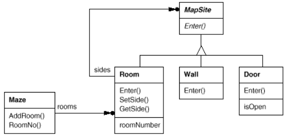


Each room has 4 sides.(`enum`)

```c++
enum Direction (North, South, East, West);
```


The `MapSite` is the **<u>primitive</u>** element of this project.

```c++
class MapSite
{
    public:
    virtual void Enter() = 0;
}
```


`Room` is the concrete subclass of `Mapsite` which defines the relationship between components in the maze.

```c++
class Room : public MapSite
{
private:
    MapSite* _sides[4];  //the private member store the 4 sides of object
    int _roomNumber;     //the room number of this room

public:
    Room(int roomNo);                      //constructor
    
    MapSite* GetSide(Direction) const;     //Get the side of a room
    void SetSide(Direction, MapSite*);     //Set the side of a room
    virtual void Enter();                  //Enter function
}
```


`Wall` occurs on each side of a room(maybe).

```c++
class Wall : public MapSite
{
public:
    Wall();                //Constructor
    virtual void Enter();  //Enter function
}
```


`Class` occurs on each side of a room(maybe).

```c++
class Door : public MapSite
{
private:
    Room* _room1;    //door attached to 2 rooms, this is one of them
    Room* _room2;    //door attached to 2 rooms, this is one of them
    bool _isOpen;    //see if it is open
    
public:
    Door(Room* = 0, Room* = 0);    //constructor with 2 rooms
    virtual void Enter();          //Enter function
    Room* OtherSideFrom(Room*);    //Return the other side by pointer
}
```


`Maze` is to represent a collection of rooms.

```c++
class Maze
{
    private:
    //..
    
    public:
    Maze();  //constructor
    void AddRoom(Room*);  //Add room to this maze
    Room* RoomNo(int) const;  //A method look-up a room number by using a linear search, a hash table,or even a simple array.
    
}
```


`MazeGame` is the class to **<u>create</u>** the maze. This is the **KEY** concept of creational patterns! 

:x:You don't explicitly define what is a `Maze` should be.

:heavy_check_mark:Rather you create the `MazeGame` with a method called `CreateMaze` with flexibility to modify the formula in the future.

```c++
Maze* MazeGame::CreateMaze()
{
    Maze* aMaze = new Maze();
    Room* r1 = new Room(1);            //init a room with RoomNo 1
    Room* r2 = new Room(2);            //init a room with RoomNo 2
    Door* doorR1R2 = new Door(r1, r2); //init a door between Room1 and Room2
    
    //Set the 4 sides of Room1
    r1 -> SetSide(North, new Wall());
    r1 -> SetSide(East, doorR1R2);
    r1 -> SetSide(South, new Wall());
    r1 -> SetSide(West, new Wall());
    
    //Set the 4 sides of Room2
    r2 -> SetSide(North, new Wall());
    r2 -> SetSide(East, new Wall());
    r2 -> SetSide(South, new Wall());
    r2 -> SetSide(West, doorR1R2);
    
    //Add the rooms to the maze
    aMaze -> AddRoom(r1);
    aMaze -> AddRoom(r2);
    
    return aMaze;
}
```


The preceding code is with great flexibility. Although you can make it simpler, you will lose the flexibility to modify the maze eventually.

For example, considering the `Room` constructor could initialize the sides with walls ahead of time.

```c++
Maze* MazeGame::CreateMaze()
{
    Maze* aMaze = new Maze();
    Room* r1 = new Room(1, new Wall(), doorR1R2, new Wall(), new Wall());
    Room* r2 = new Room(2, new Wall(), new Wall(), doorR1R2, new Wall()); 
    
    //LOST FLEXIBILITY!!!
}
```

:x::warning:It **hard-codes** the maze layout. Changing the layout means changing this member function, either by overriding it—which means reimplementing the whole thing—or by changing parts of it—which is **<u>error-prone</u>** and **<u>doesn't promote reuse</u>**.


:pushpin:**How Creational Design Patterns can help?**

The KEY idea of creational patterns is to **remove explicit references to concrete classes** from code that needs to instantiate them.

- [Factory Method][iFactory Method] - The `CreateMaze` method is <u>**virtual**</u> which allows subclass of `MazeGame` to override it.

- [Abstract Factory][iAbstract Factory] - The `CreateMaze` is passed <u>**an object as a parameter**</u> to create elements[^1] , then you can change the classes of those things by passing a different parameter.

- [Builder][iBuilder] - The `CreateMaze` is passed **<u>an object that can create a new `maze` in its entirety</u>** using operations like adding elements[^1], then you can use <u>inheritance</u> to change parts of the `maze` or the way the `maze` is built.

- [Prototype][iPrototype] - The `CreateMaze` is **<u>parameterized by various prototypical elements</u>**[^1], which it then copies and adds to the `maze`,then you can change the `maze`'s composition by replacing them.

[Singleton][iSingleton], the one not mentioned above, can <u>**ensure there's only one maze per game**</u> and that all game objects have ready access to it—**<u>without resorting to global variables or functions</u>**.


## 3.1. Abstract Factory


## 3.2. Builder


## 3.3. Factory Method


## 3.4. Prototype


## 3.5. Singleton

<div align="center">
    <figure>
        
        <figcaption>Singleton ©Dive Into Design Patterns</figcaption>
    </figure>
</div>

## 3.6. Discussion of Creational Patterns


# 4.Structural Patterns

## 4.1. Adapter


## 4.2. Bridge


## 4.3. Composite


## 4.4. Decorator


## 4.5. Facade


## 4.6. Flyweight


## 4.7. Proxy


## 4.8. Discussion of Structural Patterns


# 5.Behavioral Patterns


## 5.1. Chain of Responsibility


## 5.2. Command


## 5.3. Interpreter


## 5.4. Iterator


## 5.5. Mediator

<div align="center">
    <figure>
        
        <figcaption>Mediator ©Dive Into Design Patterns</figcaption>
    </figure>
</div>


## 5.6. Memento


## 5.7. Observer


## 5.8. State


## 5.9. Strategy


## 5.10. Template Method


## 5.11. Visitor


## 5.12. Discussion of Behavioral Patterns


[^1]: The elements here refer to instances of Wall, Door, Room


[iAbstract Factory]: #31-abstract-factory
[iBuilder]: #32-builder
[iFactory Method]: #33-factory-method
[iPrototype]: #34-prototype
[iSingleton]: #35-singleton

[iAdapter]: #41-adapter
[iBridge]: #42-bridge
[iComposite]: #43-composite
[iDecorator]: #44-decorator
[iFacade]: #45-facade
[iFlyweight]: #46-flyweight
[iProxy]: #47-proxy


[iChain of Responsibility]: #51-chain-of-responsibility
[iCommand]: #52-command
[iInterpreter]: #53-interpreter
[iIterator]: #54-iterator
[iMediator]: #55-mediator
[iMemento]: #56-memento
[iObserver]: #57-observer
[iState]: #58-state
[iStrategy]: #59-strategy
[iTemplate Method]: #510-template-method
[iVisitor]: #511-visitor

