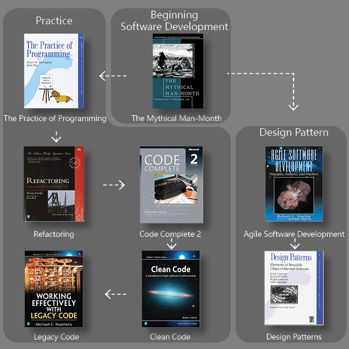

# Software Development
This is the repo I learned software development. The learning path is divided into 3:

- 1️⃣Beginning Software Development
  - [The Mythical Man-Month](./0_Beginning/MythicalManMonth/README.md)                                                                             🔃████████ 100%
- 2️⃣Practice
  - [The Practice of Programming](./1_Practice/ThePracticeOfProgramming/README.md)                                                                     🔃░░░░░░░░0%
  - [Refactoring](./1_Practice/Refactoring/README.md)                                                                                                     🔃░░░░░░░░0%
  - [Code Complete](./1_Practice/CodeComplete/README.md)                                                                                             🔃░░░░░░░░0%
  - [Clean Code](./1_Practice/CleanCode/README.md)                                                                                                    🔃░░░░░░░░0%
  - [Working Effectively With Legacy Code](./1_Practice/LegacyCode/README.md)                                                      🔃░░░░░░░░0%
- 3️⃣Design Patterns
  - [Agile Software Development](./2_DesignPattern/AgileSoftwareDevelopment/README.md)                                                                     🔃██░░░░░░20%
  - [Design Patterns: Elements of Reusable Object-Oriented Software](./2_DesignPattern/DesignPatterns/README.md)    🔃█░░░░░░░ 13%

